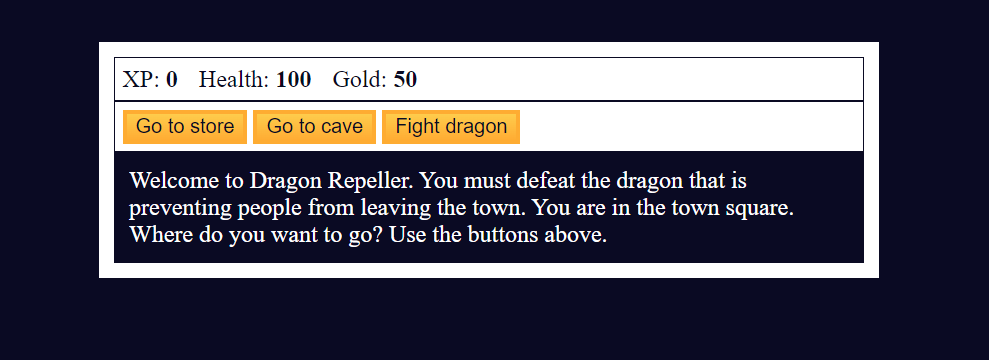

# RPG-Dragon Game

RPG-Dragon Repeller is a simple text-based role-playing game implemented in HTML and JavaScript. The game allows players to navigate through different locations, engage in battles with monsters, buy health and weapons from a store, and ultimately defeat the dragon to win the game.





## Used

- HTML Structure
- JavaScript Code
- CSS
## How to Play

- Open the HTML file in a web browser.

- Players start in the town square and can navigate to the store, cave, or fight the dragon.
- In the store, players can buy health or weapons.
- In the cave, players can choose to fight different monsters.
- Battles involve attacking, dodging, and running.
- Winning battles earns gold and experience points.

The game ends when the player defeats the dragon (win) or loses all health (lose).

An easter egg feature allows players to pick numbers for additional rewards or penalties.

Enjoy playing RPG-Dragon Repeller!


## Run Locally

Clone the project

```bash
  git clone https://github.com/Meybe-1in/Role-Playing-Game.git
```

Go to the project directory

```bash
  cd Role-Playing-Game
```

Open in Browser

Save your changes to the HTML file.
Open the HTML file in a web browser. You can do this by right-clicking on the HTML file and selecting "Open with" and choosing your preferred browser.


